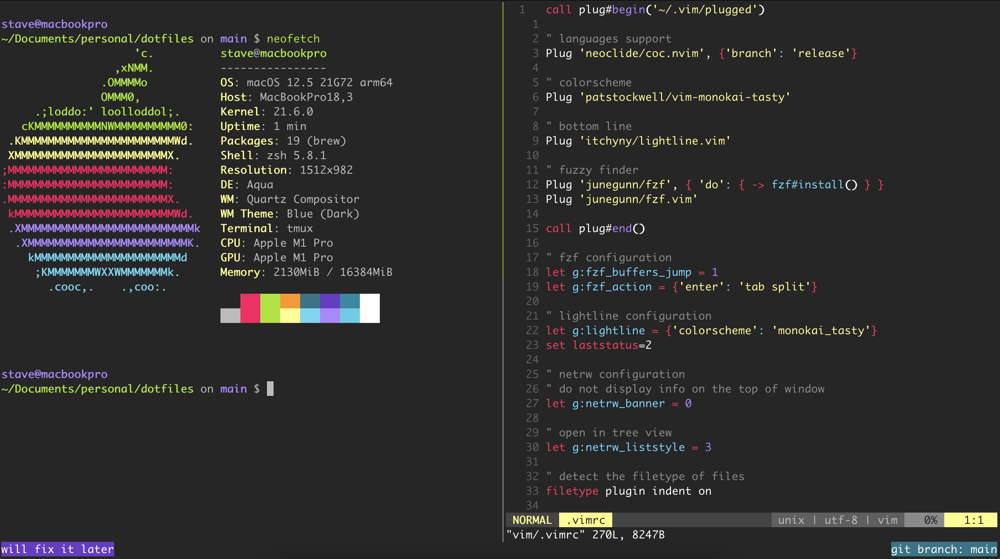

# dotfiles



## Dependencies

Before running the installation script, you should install the
following dependencies

- [Zsh](https://github.com/ohmyzsh/ohmyzsh/wiki/Installing-ZSH)
- [Git](https://git-scm.com/downloads)
- [Tmux](https://github.com/tmux/tmux)
- [fzf](https://github.com/junegunn/fzf)
- [Vim](https://www.vim.org/download.php)
- [Vim Plug](https://github.com/junegunn/vim-plug)
- [Node >=16](https://nodejs.org/en/download/)
- [Bat](https://github.com/sharkdp/bat#installation)
- [Brew](https://brew.sh/)
- [iTerm2](https://iterm2.com/)

## Info

### Zsh
Zsh is using a custom theme called [`x`](./zsh/themes/x.zsh-theme).

Also, it uses the following plugins:
- `git`
- `zsh-autosuggestions`
- `zsh-syntax-highlighting`


### Tmux
Tmux has the mouse scrolling enabled. Also, the following keys are being replaced.
- `ctrl-b` -> `ctrl-a`

Last, typing the binding `ctrl-space-enter`, a new small window will be opened vertically.

## Installation

> **WARNING**: The script will uninstall & remove all the  configuration files. It will install them from scratch. Be sure to backup your files first.

Run:

```bash
git clone https://github.com/Stavrospanakakis/dotfiles.git
cd dotfiles
sh install.sh
```

Then import `iterm/colors.itermcolors` to iTerm2.

Finally, run into vim the following command `:CocInstall coc-go coc-html coc-css coc-tsserver coc-python coc-tabnine`
